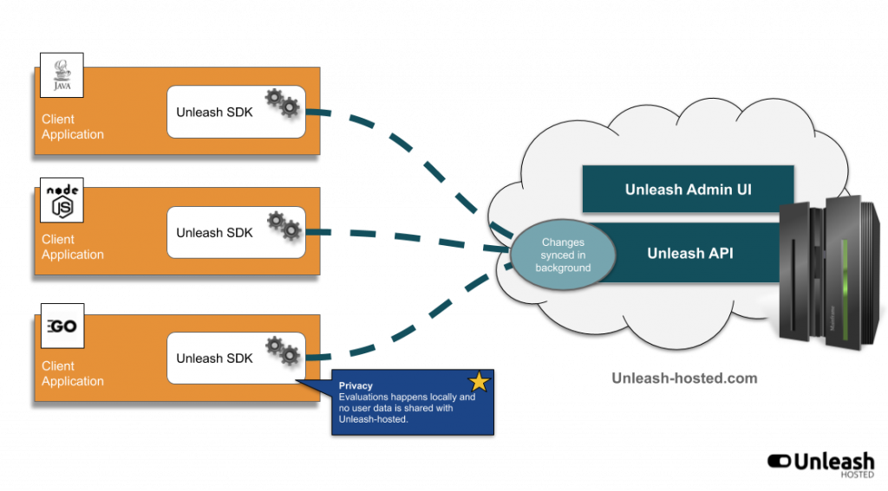

A feature toggle is a technique in software development used for allowing to
test a software feature on a live system even before it is completely implemented
and ready to be released to the general public. The feature toggle is used to hide,
enable or disable the feature during runtime.

Feature toggles are an important technique used for the implementation of [continous
delivery](https://en.wikipedia.org/wiki/Continuous_delivery) with the intricate aim
of providing rapid feedback about the features implemented to the software engineers.

Feature toggles are essentially variables that are used inside conditional statements.
Therefore, the blocks of code inside these conditional statements can be toggled
<span style="color:green">**ON**</span> or <span style="color:red">**OFF**</span> depending on the value of the feature toggles.
In a simple form a feature toggle works in the following fashion:

```java
   if (modern page header is enabled) {
      // render modern page header
      // ...
   } else {
      // render classic page header
      // ...
   }
```

Feature toggles can be stored as:

- properties in a configuration file
- row entries in a database table
- entries in external feature toggle service


Here is a description about feature flags functionality done by Chad Dickerson from [Etsy](https://www.etsy.com):

> “We practice continuous deployment and make small changes frequently to the site.
> We use what we call "config flags", ...and a lot of the code for features runs “dark” for days or weeks,
> and feature launches mean flipping a switch in the code.”


Ideally, the process of enabling or disabling a new feature in production
should happen without any code changes, new deployment or application restart.

## Unleash

As pointed out in the [Unleash](https://unleash.github.io/) project page:

> Feature toggles decouple deployment of code from release of new features


Through the usage of [Unleash](https://unleash.github.io/) feature toggle service,
new functionalities can be released to production with the possibility of
enabling/disabling them at any later point of time through an admin UI outside
of the running web application that makes use of the feature toggles.


[Unleash]((https://unleash.github.io/))
feature toggle service comes with a lot of functionalities to address in depth
the needs related to feature toggles:

- Unleash client SDK can be embedded in any kind of application written in any popular programming language
- provides an administration web UI to manage and track within the last minute/hour the usage of the feature toggles
- provides a set of strategies associated with the feature toggles in order to enable gradual rollout of the features.
In this way, a feature could be safely rolled out only for a subset (e.g. : specific emails, specific IPs,
only Desktop/Mobile) of the users of the website that makes use of feature toggles.


Common activation strategies offered by Unleash:

- Active For users with a specified userId
- GradualRollout to X-percent of the users
- Active for beta users
- Active only for application instances running on host x.

**NOTE** that Unleash offers the possibility to easily write custom strategies (e.g. : active for users with a specified device - based
on the `User-Agent` web request header).

Below is shown an architectural overview of the Unleash system:



As can be seen from the picture above, the client applications are supposed to embed the Unleash client SDK
and communicate with the server for reading the feature toggles. The Unleash server is written in Node.js.

At the time of this writing, there exist Unleash client SDK implementations for Java, Node.js, Go, Ruby, Python and .NET Core.

The client SDKs connect internally to Unleash REST API and retrieve the feature toggles with information
about their associated strategy:

```bash
➜  ~ curl -s http://localhost:4242/api/client/features | jq
{
  "version": 1,
  "features": [
    {
      "name": "blueHeader",
      "description": "Whether the header should be shown in blue",
      "enabled": true,
      "strategies": [
        {
          "name": "default"
        }
      ],
      "variants": null,
      "createdAt": "2020-09-30T21:20:46.154Z"
    },
    {
      "name": "qotd",
      "description": "Quote of the day",
      "enabled": true,
      "strategies": [
        {
          "name": "userWithId",
          "parameters": {
            "userIds": "bob,john"
          }
        }
      ],
      "variants": null,
      "createdAt": "2020-09-30T21:34:37.612Z"
    },
    {
      "name": "specialGreeting",
      "description": "The user receives a customized special greeting",
      "enabled": true,
      "strategies": [
        {
          "name": "deviceClass",
          "parameters": {
            "device": "Desktop,Tablet"
          }
        }
      ],
      "variants": null,
      "createdAt": "2020-10-01T20:03:16.114Z"
    }
  ]
}

```

As pointed out by the Unleash [documentation](https://unleash.github.io/docs/client_specification):

> To be super fast, the client SDK caches all feature toggles and their current configuration in memory.
> The activation strategies are also implemented in the SDK.
>
> This makes it really fast to check if a toggle is on or off because it is just a simple function operating
> on local state, without the need to poll data from the database.


**NOTE** that this means that no data (regardless whether it is sensitive or not) about the users (e.g. : username, IP, name, address, etc. )
of the website will be sent towards the Unleash server in order to check whether a feature is enabled when displaying a web page.

In case there exist doubts about having an ever increasing payload related to the Unleash feature toggles configuration
that needs to be continously refreshed in the client application, Pete Hodgson,
in his article [Feature Toggles (aka Feature Flags)](https://martinfowler.com/articles/feature-toggles.html),
points out an interesting insight about the amount of feature toggles employed in a web application:

> Savvy teams view their Feature Toggles as inventory which comes with a carrying cost, and work
> to keep that inventory as low as possible.


## Competition for Unleash

- [LaunchDarkly](https://launchdarkly.com/)
- [FLAGR](https://github.com/checkr/flagr)
- [Petri](https://github.com/wix-incubator/petri)

## Demo

This blog post comes with a proof of concept [Spring Boot](https://spring.io/projects/spring-boot)
web application that showcases the functionality provided by [Unleash](https://unleash.github.io/)
feature toggle service.

Check out the source code on [Github](https://github.com/findinpath/unleash-demo) and feel free to
try it out.


## Articles related to feature toggles

- Pete Hodgson - [Feature Toggles (aka Feature Flags)](https://martinfowler.com/articles/feature-toggles.html)
- Martin Fowler - [FeatureToggle](https://martinfowler.com/bliki/FeatureToggle.html)

## Feedback

This blog post serves as a proof of concept for using feature toggles.
Eventual improvements to the project code or ideas regarding
alternative ways to gradually roll out features are very much welcome.

