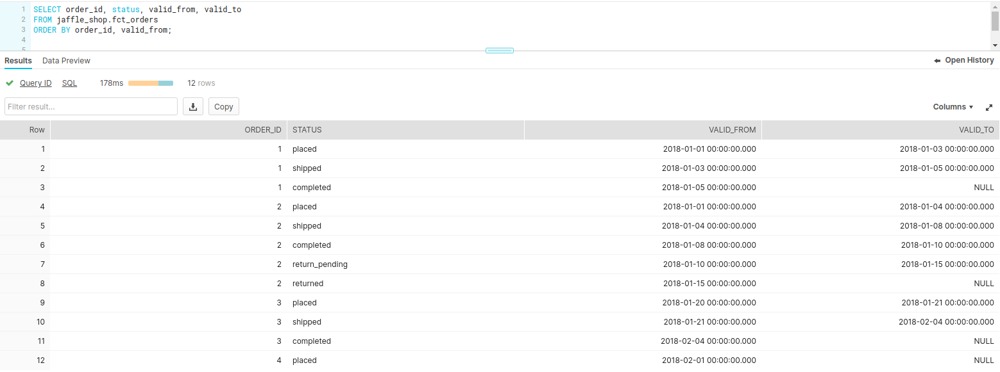

Historize the status changes performed on the database entities an obtain the date ranges
corresponding to the validify of each status in which the entity has been during its lifecycle.

Let's use a fictional example of an online ecommerce store, where the `orders` table
in the database backing the store is be one of the core entities.

An order can find itself, throughout its lifecycle in one of the statuses:

- placed
- shipped
- completed
- return_pending
- returned

The content of the `orders` table could be ingested in a data warehouse environment
in order to perform several reports concerning the performance of the ecommerce store.

Nowadays a key aspect in ecommerce is the delivery time, or more concretely in the case
of our fictional ecommerce store, the period of time in which an order is marked with the
status `shipped` (order has been shipped to the customer and is currently in transit).

The data warehouse environment could be therefore used to answer several questions that focus
on the shipment:

- What is the amount of orders that were marked in shipment during a certain day?
If the trend of the orders in shipment doesn't follow closely the trend of completed
orders then the ecommerce shop has a growing number of unsatisfied customers.
- How many orders took more than `3` business days during a certain month?
Identify whether there the service level agreement for deliveries is not
being respected.
- What is the highest amount in days for an order in shipment during a certain month?
From an operational perspective this number should be kept as low as possible. Possible
spikes above the average should trigger automatic alerts for the person responsible
on the deliveries.

For the sake of having a concrete example, let's suppose that the structure of the
staging table in the data warehouse environment that corresponds for the `orders` database
table from the ecommerce store would have the following columns:

- load_id: monotonically increasing sequence for the order changes
- order_id: the order identifier
- updated_at: the date when the order was updated
- status: completion status of the order

Let's try to answer the following question:

> What is the amount of orders that were marked in shipment during a certain day?

**NOTE** that a shipment can take multiple days until the package reaches the customer and the order is marked as `completed`.

A naive answer would be to count the distinct orders from the staging table where status `shipped` is appearing
during the specified day (e.g.: `2018-01-01`)

```sql
SELECT COUNT(DISTINCT order_id)
FROM jaffle_shop.stg_orders
WHERE updated_at BETWEEN '2018-01-01' AND '2018-01-02'
AND status = 'shipped';
```

In this case the orders that started being shipped before the `2018-01-01` and completed during or after this day
would not be taken into account.

One possible solution in order to the question previously mentioned would be to historize the status changes performed on the
orders.

The image below contains historized order status changes.
Note that the [`valid_from`, `valid_to`] date ranges  corresponding to an order are adjacent to each other
and only the latest entry corresponding to an order  is unbounded (`valid_to` is set to `NULL`):




This technique allows to easily find the shipment date ranges that overlap with the day on which the number or orders
in shipment needs to be calculated:

```sql
SELECT COUNT(DISTINCT(order_id))
FROM jaffle_shop.fct_orders
WHERE valid_from < '2018-01-02' AND (valid_to >= '2018-01-01' OR valid_to IS NULL)
AND status = 'shipped';
```


This post provides a proof of concept on how to historize order status changes with [dbt](https://www.getdbt.com/)
models on [Snowflake](https://www.snowflake.com/) data warehouse environment.


## Getting started with dbt

As described in the [introduction to dbt](https://docs.getdbt.com/docs/introduction) :

> dbt (data build tool) enables analytics engineers to transform data in their warehouses by simply writing select statements.
> dbt handles turning these select statements into tables and views.

> dbt does the T in ELT (Extract, Load, Transform) processes – it doesn't extract or load data,
> but it’s extremely good at transforming data that’s already loaded into your warehouse.

The [jaffle_shop](https://github.com/fishtown-analytics/jaffle_shop)
project is a useful minimum viable dbt project to get new [dbt](https://www.getdbt.com/) users
up and running with their first dbt project. It includes [seed](https://docs.getdbt.com/docs/building-a-dbt-project/seeds)
files with generated data so that a user can run this project on their own warehouse.

---
For more information on dbt:

* Read the [introduction to dbt](https://docs.getdbt.com/docs/introduction).
* Read the [dbt viewpoint](https://docs.getdbt.com/docs/about/viewpoint).


## Demo

This blog post is accompanied by the [dbt\_jaffle\_shop\_historized](https://github.com/findinpath/dbt_jaffle_shop_historized)
project which provides a working prototype for a minimal [dbt](https://www.getdbt.com/) project centered
on order status changes.

The project contains the implementation for the `historized` `dbt` macro used for keeping track of the order status
changes in the lifecycle of orders  as well as corresponding [dtspec](https://github.com/inside-track/dtspec)
(data transformation specification) tests used to ensure the accuracy for the `dbt` macro.


## dbt historized macro

dbt offers the possibility of using [macros](https://docs.getdbt.com/docs/building-a-dbt-project/jinja-macros/#macros).
Macros are pieces of code that can be reused multiple times - same as _functions_ in other programming languages.

By means of using a specialized _macro_ for the historization functionality, the complexity of building the historization
queries is fully abstracted and the readability of the query used for historizing the status changes is greatly simplified:


```sql
{{
    config(
        materialized = 'historized',
        primary_key_column_name = 'order_id',
        valid_from_column_name = 'updated_at',
        load_id_column_name = 'load_id'
    )
}}

select
        load_id,
        order_id,
        updated_at,
        status
from {{ ref('stg_orders') }}

```


As can be seen in the code snippet above, same as a function, the `historized` macro takes a few parameters:

- `primary_key_column_name`: the name of the column used to identify the staged entity
- `valid_from_column_name`: the name of the column containing the timestamp when the staged entity has been last updated.
- `load_id_column_name`: the name of the column containing monotonically increasing sequence values used for distinguishing the precedence
between order status changes that happen within the same timestamp.


Behind the scenes, the logic encapsulated in the `historized` `dbt` macro follows the steps mentioned below:

- create a temporary table (suffixed by `__tmp`) which contains the staged entries along with `md5_hash` column containing hash of the concatenated columns used for
historization (e.g. : `status` in case of this example, but nothing speaks agains historizing more columns on an entity).
The hash column can be used to easily distinguish whether two adjacent entries (ordered by load id) are
duplicated (have the same values for the versioned columns).
For more information on hashing, read on [The most underutilized function in SQL](https://blog.getdbt.com/the-most-underutilized-function-in-sql/) dbt blog post.
- in case whether there are new entries staged (from the `__tmp` suffixed source table) that correspond to an
unbounded historized entity (`valid_to` column is `NULL`) in the target table, then set the upper bound column `valid_to`
to the value corresponding to the minimum `valid_from` value of the staged entries corresponding on the target entity
- deduplicate the staged entries (based on the `md5_hash` column)
- obtain the validity range for each of the staged records (`valid_from`, `valid_to`)
- join the staged records with the records from the target table and filter out eventual duplicates (based on `md5_hash`)
- insert the staged records in the target table.

---
For more information on dbt macros:

* Read the [introduction to Jinja macros](https://docs.getdbt.com/docs/building-a-dbt-project/jinja-macros/#macros).
* Read about the [dbt materializations](https://docs.getdbt.com/docs/building-a-dbt-project/building-models/materializations/)
and their corresponding implementation on [Github](https://docs.getdbt.com/docs/building-a-dbt-project/building-models/materializations/).


## Data tranformation testing

It takes quite a while to develop a `dbt` macro and afterwards it needs to be tested whether it works.
It may even happen that while it is productively used, a bugfix needs to be done or that the functionality of
the macro needs to be extended.
By means of using automated tests for data transformations there could be ensured that the macro works
as expected with an extensive battery of tests on a test environment.

[dtspec](https://github.com/inside-track/dtspec) is an open-source framework written in Python which can be used
for specifying and testing data transformations.

Within `dtspec` is specified in a [yaml](https://en.wikipedia.org/wiki/YAML) format:

- the source data in the table(s) to be used by the data transformation(`dbt`)
- the expected data from the target table(s).

`dtspec` framework offers means to read the yaml specification, and match the data from the actual tables, once
the data transformation has been performed (via `dbt`) with the data from the specification scenario.


Below is presented a snippet of the output used for running the tests on the project
[dbt\_jaffle\_shop\_historized](https://github.com/findinpath/dbt_jaffle_shop_historized)
which accompanies this blog post:

```generic
Executing test specification tests/demo-spec.yml
Truncating data from the tables ['raw_orders', 'fct_orders']
Inserting input data into the source table raw_orders
/home/findinpath/dbt_jaffle_shop_historized/tests/..
Running with dbt=0.18.1
Found 2 models, 11 tests, 0 snapshots, 0 analyses, 148 macros, 0 operations, 1 seed file, 0 sources

21:51:29 | Concurrency: 4 threads (target='dev')
21:51:29 |
21:51:29 | 1 of 2 START table model jaffle_shop.stg_orders...................... [RUN]
21:51:31 | 1 of 2 OK created table model jaffle_shop.stg_orders................. [SUCCESS 1 in 2.02s]
21:51:31 | 2 of 2 START historized model jaffle_shop.fct_orders................. [RUN]
21:51:35 | 2 of 2 OK created historized model jaffle_shop.fct_orders............ [SUCCESS 1 in 4.39s]
21:51:36 |
21:51:36 | Finished running 1 table model, 1 historized model in 10.58s.

Completed successfully

Done. PASS=2 WARN=0 ERROR=0 SKIP=0 TOTAL=2
Loading data from the target table fct_orders
Loading actuals for target fct_orders
Asserting Building fct_orders out of the raw_orders when the fct_orders table is empty: Basic full refresh loading of the historized fact table `fct_orders`
Tested scenarios: - order1 : the expected historized entries should follow the representation: placed > shipped > completed - order2 : the expected historized entries should follow the representation: placed - order3 : contains duplicated (with the same `updated_at` and `status` values) entries. The duplicates should be filtered out from the processing. The expected historized entries should follow the representation: placed > shipped > return_pending
 PASSED

```

As can be seen from the log snippet above, there are several steps performed:

- the source & target tables for the data transformation are truncated to make sure that the execution
of the tests is fully repeatable.
- input data is inserted in the source table(s)
- `dbt` is executed for performing the data transformation on the: `jaffle_shop.stg_orders`, `jaffle_shop.fct_orders` models.
- the actual data from target tables of the test specification is loaded and is used in asserting
the equality with the content of the columns mentioned in the target table from the test specification


**NOTE** : When running the tests for this project, there can be noticed that it takes quite some time to execute them.
This happens in part because Snowflake takes roughly a bit under a second to run any kind of query, even
if the query is performed on an empty database.

Nevertheless, having automated tests for the `dbt` models, even though they are slow, is much better than doing the
tests by hand or not doing them at all and leaving production as a playground for the developed models.


## Feedback

This blog post serves as a proof of concept for historizing database entities with `dbt`.
Eventual improvements to the [dbt\_jaffle\_shop\_historized](https://github.com/findinpath/dbt_jaffle_shop_historized)
project code or ideas regarding alternative ways to historize changes on the database entities are very much welcome.

