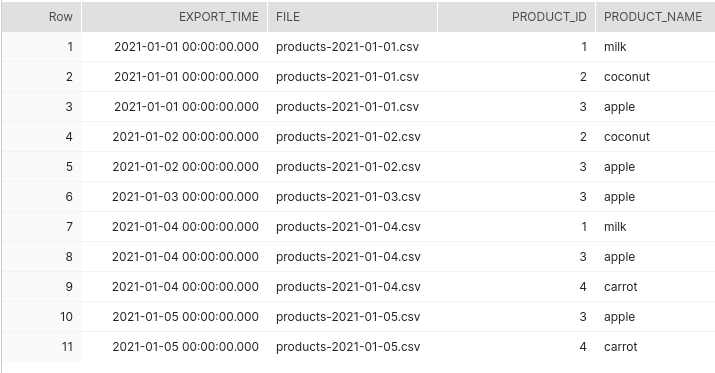
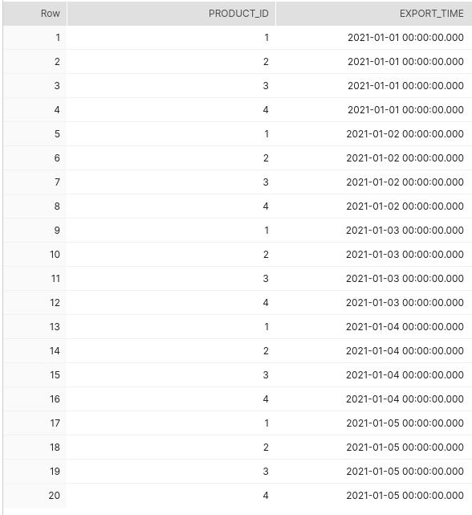
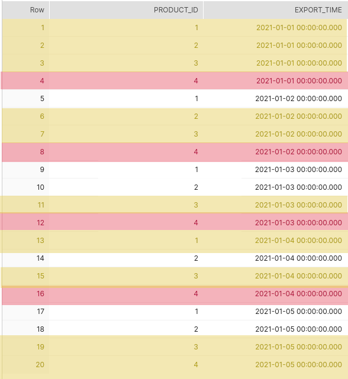
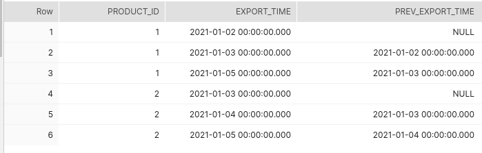
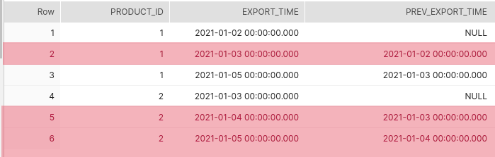
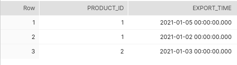

This post concentrates on the enhancing ELT staging data for being able to infer entries which
are missing from one batch export to the next one.


Suppose that a shop is exporting daily towards the data warehouse environment the
whole list of its active products in csv files:

- `products-2021-01-01.csv`
- `products-2021-01-02.csv`
- `products-2021-01-03.csv`
- `products-2021-01-04.csv`
- `products-2021-01-05.csv`
- ...


Obviously from a day to the next there may be new products which get activated or existing
products which get deactivated.

Nowadays there are source systems which simply do a snapshot of the existing products
without providing any information about the deleted products since the previous export.

This missing information requires special effort on the data warehouse side in order to accurately
infer the date range(s) for which the products in the shop were active.

If for a certain period of time, there is no product data ingested in the data warehouse,
it may happen that the product data corresponding to several days in a row may need to be
staged in the data warehouse.

This might be also the case when a bug is found in the historization of the product data
which may involve a full reload of all the product staging data.


## Historization of the product availability

In order to fully historize the product availability there needs to be made the following
data sets need to be combined together:

```sql
product staging data
UNION
inferred deletions within the product staging data (what this blog post concentrates on)
UNION
inferred deletions from the active products within the already historized data
that do not appear in the last exported staging day
```

The formula briefly described above, provides the necessary input data for being able to
historize in detail the product availability date ranges.

On the basis of the insertions & deletions for the products within the data warehouse environment
the availability date ranges for each of the products from the shop can be accurately calculated.


## Infer deletions in the staging data

This article doesn't go in the details on how to historize the product availability within the
data warehouse environment, but rather concentrates on how to enhance the staging data so to identify deleted
entries within the staging data when exported data for the products corresponding to multiple days
are imported at the same time.

If everything goes well and every day the products are staged successfully, the logic presented below
will never be used.

On the other hand, when there are multiple days processed at the same time, it can get difficult to
find out exactly which are the availability date ranges for a product which gets activated and deactivated
several times during the processed days.

Let's suppose that some of the products are very short-lived (e.g. : they are active only for a day on the shop).


e.g. : supposing that product data for each of the dates from the interval
`2021-01-01` - `2021-01-05` is being staged at the same time.
The product `milk` is available on `2021-01-01` , but not available
anymore on `2021-01-02`, then again available on `2021-01-04` and not available anymore
again starting from `2021-01-05`.

In the scenario described above, for the product milk, there should be created artificially deletion
entries for the dates:
- `2021-01-02`
- `2021-01-05`

On the example of the _milk_ product suggested above, the availability intervals in the staging data
would be:

- `2021-01-01` - `2021-01-02`
- `2021-01-04` - `2021-01-05`


For the sake of an easier reading of what this (rather exotic) problem is trying to solve,
here will be presented visually, step by step how the deletions of the products from the
staged data are being inferred.

If the `raw_products` staging table has the following representation:




**NOTE** that here is made the supposition that the exported products for a certain day
share the same `export_time` timestamp. The algorithm presented here works only when this
supposition is met.

The starting point in the journey of inferring deletions within the staging data
is to build a cartesian product between the staging dates and the staged product ids:

```sql
SELECT product_id,
       export_time
FROM (
        (SELECT DISTINCT product_id
        FROM playground.dbt_shop.raw_products)
        CROSS JOIN
        (SELECT DISTINCT export_time
        FROM playground.dbt_shop.raw_products) AS staged_date
);
```



From the cartesian product the following <product id, export_time> entries are chopped off:
- the ones that happen before  the first appearance of a staged entry for a product (marked in red)
- the ones that are found within the staging entries (marked in yellow)


```sql
SELECT product_id,
       export_time
FROM (
          SELECT product_id,
                 export_time
          FROM (
                  (SELECT DISTINCT product_id
                  FROM playground.dbt_shop.raw_products)
                  CROSS JOIN
                  (SELECT DISTINCT export_time
                  FROM playground.dbt_shop.raw_products) AS staged_date
          )
) staged_product_date
WHERE staged_product_date.export_time > (
                                             SELECT MIN(export_time)
                                             FROM playground.dbt_shop.raw_products
                                             WHERE product_id = staged_product_date.product_id
                                         )
  AND staged_product_date.export_time
        NOT IN (
                    SELECT DISTINCT export_time
                    FROM playground.dbt_shop.raw_products
                    WHERE product_id = staged_product_date.product_id
               );
```



The result of this filtering is represented by all the <product, export_time> entries that are not found
within the staging entries:



Now some of the resulting entries are not necessary. If a product is deleted after the first staging day and
does not occur anymore subsequently, the entry with the minimum export_time is enough information.

What might happen though is that a product is deleted on one day, and appears again on a later day
and is subsequently deleted again later. Between the two deletion dates we'll have obviously a gap
greater than one export day (because the product is in between at least one day active).

In order to cope with such a situation, the [LAG](https://docs.snowflake.com/en/sql-reference/functions/lag.html)
window function is being used in order to identify greater gaps between the deletions :

```sql
SELECT product_id,
       export_time
FROM (
        SELECT product_id,
               export_time,
               LAG(export_time) OVER (PARTITION BY product_id ORDER BY export_time) prev_export_time
        FROM (
                  SELECT product_id,
                         export_time
                  FROM (
                          (SELECT DISTINCT product_id
                          FROM playground.dbt_shop.raw_products)
                          CROSS JOIN
                          (SELECT DISTINCT export_time
                          FROM playground.dbt_shop.raw_products) AS staged_date
                  )
        ) staged_product_date

        WHERE staged_product_date.export_time > (
                                                     SELECT MIN(export_time)
                                                     FROM playground.dbt_shop.raw_products
                                                     WHERE product_id = staged_product_date.product_id
                                                 )
          AND staged_product_date.export_time
                NOT IN (
                            SELECT DISTINCT export_time
                            FROM playground.dbt_shop.raw_products
                            WHERE product_id = staged_product_date.product_id
                       )
) AS missing_staged_product
WHERE (
        (missing_staged_product.prev_export_time IS NULL)
        OR missing_staged_product.export_time != (
                                                        SELECT MIN(export_time)
                                                        FROM playground.dbt_shop.raw_products
                                                        WHERE export_time > missing_staged_product.prev_export_time
                                                  )
);
```

The filtering can be observed (marked in red) in the following image:




The operation applied previously corresponds now to the inferred batched product deletions:




## Demo

The concepts described in this blog post can be tried out in the project
[dbt\_infer\_deletions\_in\_batched\_staging\_data](https://github.com/findinpath/dbt_infer_deletions_in_batched_staging_data)
that is accompanying this blog post.

The project includes a [data build tool](https://www.getdbt.com/) model that can be used to infer
deletions within the staging ELT data.
The nice thing about this SQL demo is that it contains also automatic
test specifications (based on [dtspec](https://github.com/inside-track/dtspec)) in order to verify
the accuracy of the implementation against [Snowflake](https://www.snowflake.com/) database.


## Feedback

This blog post serves as a proof of concept for finding deletions within staging data loaded in batched fashion.
Eventual improvements to the [dbt\_infer\_deletions\_in\_batched\_staging\_data](https://github.com/findinpath/dbt_infer_deletions_in_batched_staging_data)
project code or ideas regarding alternative ways to solve this problem are very much welcome.

