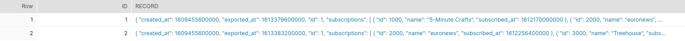
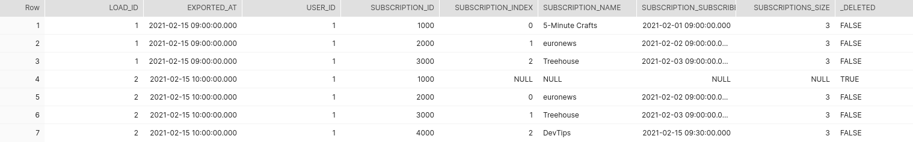

This post concentrates on the enhancing ELT staging data for being able to infer entries which
are missing from parent-child `JSON` staging data.


Suppose that a video platform where the users can make channel subscriptions has a data pipeline
to its Data Warehouse system for exporting in case of changes the data about its users in near
real-time.

Let us suppose for the sake of simplicity that the data exported towards the data warehouse
follows this format:

```bash
user
  - id: NUMBER
  - username: VARCHAR
  - created_at: DATETIME
  - exported_at: DATETIME

  subscriptions
    - id: NUMBER
    - name: VARCHAR
    - subscribed_at: DATETIME
```

Between the user and the subscriptions there is a `1:N` relationship.

Obviously such a design is far from ideal in case of dealing with a real-world mainstream video platform where
a user can have hundreds or even thousands of subscriptions, but due to the fact that video platform
concepts are so spread, this is a nice fit for better explaining the problem tackled in this blog post.

In the time between two exports of the user subscription changes of a specific user data, there can be that new subscriptions
get added and some of the subscriptions can also be removed (when the user unsubscribes from a channel).

e.g. : Let's suppose that in the user subscriptions staging data there are found for the user _johndoe_ two entries:

```json
{
  "id": 1,
  "username": "johndoe",
  "created_at": 1609455600000,
  "exported_at": 1613379600000,
  "subscriptions": [
    {
      "id": 1000,
      "name": "5-Minute Crafts",
      "subscribed_at": 1612170000000
    },
    {
      "id": 2000,
      "name": "euronews",
      "subscribed_at": 1612256400000
    },
    {
      "id": 3000,
      "name": "Treehouse",
      "subscribed_at": 1612342800000
    }
  ]
}
```

and

```json
{
  "id": 1,
  "username": "johndoe",
  "created_at": 1609455600000,
  "exported_at": 1613383200000,
  "subscriptions": [
    {
      "id": 2000,
      "name": "euronews",
      "subscribed_at": 1612256400000
    },
    {
      "id": 3000,
      "name": "Treehouse",
      "subscribed_at": 1612342800000
    },
    {
      "id": 4000,
      "name": "DevTips",
      "subscribed_at": 1613381400000
    }
  ]
}
```

Between `2021-02-15 09:00:00` and `2021-02-15 10:00:00` the user _johndoe_ made a new subscription to the channel
_DevTips_ and unsubscribed from the channel _5-Minute Crafts_.

This proof of concept project offers a solution on how to infer deletions of child entities within complex objects
from the staging data.

In the scenario described above, an artificially created deletion entry should be created in order to point out
approximately when the channel _5-Minute Crafts_ has been unsubscribed by the user _johndoe_.

On the basis of the insertions & deletions for the user subscriptions a data engineer can accurately
find out across time the subscriptions that the users have made and how long they did last.


## Historization of the user subscriptions

The basis for historization logic for the user subscriptions would be summarized by the union of the following
data sets:

```sql
user subscriptions staging data
UNION
inferred deletions within the user subscriptions staging data (what this project concentrates on)
UNION
inferred deletions from the active user subscriptions within the already historized data
that do not appear in the last exported user subscription data
```

On the example of the _johndoe_ user suggested above, the subscription availability intervals
after processing the staging data at `2021-02-15 10:00:00` would be:

| Channel name      |  Subscribed at         | Unsubscribed at       |
|-------------------|:----------------------:| ---------------------:|
| 5-Minute Crafts   | `2021-02-01 09:00:00`  | `2021-02-15 10:00:00` |
| euronews          | `2021-02-02 09:00:00`  |                       |
| Treehouse         | `2021-02-03 09:00:00`  |                       |
| DevTips           | `2021-02-15 09:30:00`  |                       |


## Infer deletions in the staging data

Let us assume that the raw staging data looks exactly as in the hypothetical example presented previously
for the user _johndoe_:

```sql
select *
from playground.dbt_video_platform.raw_user_subscription;
```




One possible solution for the problem described in the introduction of this project is presented in the code
below:


```sql
WITH src_user_subscriptions AS (
        SELECT  load_id,
                exported_at,
                LEAD(load_id)  OVER (PARTITION BY user_id ORDER BY exported_at, load_id)      AS next_load_id,
                LEAD(exported_at)  OVER (PARTITION BY user_id ORDER BY exported_at, load_id)  AS next_exported_at,
                user_id,
                subscriptions,
                ARRAY_SIZE(subscriptions)                                                     AS subscriptions_size
        FROM (
                    SELECT id                                                    AS load_id,
                           record:id::NUMBER                                     AS user_id,
                           TO_TIMESTAMP(record:exported_at::NUMBER,3)            AS exported_at,
                           record:subscriptions::VARIANT                         AS subscriptions
                    FROM playground.dbt_video_platform.raw_user_description
        )
), user_subscription AS (
        SELECT src.load_id,
               src.exported_at,
               src.next_load_id,
               src.next_exported_at,
               src.user_id,
               subscription.value:id::NUMBER                              AS subscription_id,
               subscription.index                                         AS subscription_index,
               subscription.value:name::VARCHAR                           AS subscription_name,
               TO_TIMESTAMP(subscription.value:subscribed_at::NUMBER,3)   AS subscription_subscribed_at,
               src.subscriptions_size
        FROM src_user_subscriptions src
        LEFT OUTER JOIN TABLE(FLATTEN(input => src.subscriptions)) subscription ON 1=1
        WHERE subscriptions_size > 0
)

SELECT load_id,
       exported_at,
       user_id,
       subscription_id,
       subscription_index,
       subscription_name,
       subscription_subscribed_at,
       subscriptions_size,
       FALSE                                     AS _deleted
FROM user_subscription
WHERE subscriptions_size> 0

UNION ALL

-- create artificially deleted entries for the subscriptions which don't exist in
-- the next staging occurrence of the user's subscriptions
SELECT next_load_id                             AS load_id,
       next_exported_at                         AS exported_at,
       user_id,
       subscription_id,
       NULL                                     AS subscription_index,
       NULL                                     AS subscription_name,
       NULL                                     AS subscription_subscribed_at,
       NULL                                     AS subscriptions_size,
       TRUE                                     AS _deleted
FROM user_subscription   AS current_user_subscription
WHERE next_load_id IS NOT NULL
  AND NOT EXISTS (
        SELECT 1 FROM user_subscription AS next_user_subscription
        WHERE current_user_subscription.next_load_id = next_user_subscription.load_id
          AND current_user_subscription.subscription_id = next_user_subscription.subscription_id
  )
```


Summarized, the `SQL` query above takes the complex JSON user entities from the raw staging table and flatten them to user subscriptions.
Subsequently each of the user subscription will get attached `load_id` and `exported_at` information from the next user subscription staging
entry per `user_id`.

Inferring the deletions is now simple because there needs only to be checked whether a user subscription
does not have a corresponding subscription in the next staging occurence for the user.


The outcome of this transformation can be seen below:

```sql
select *
from playground.dbt_video_platform.stg_user_subscription
order by load_id, subscription_id;
```




In the image above can be noticed that the subscription of the user _johndoe_ with the ID `1000`
identifying the _5-Minute Crafts_ channel  that was present for the user in the staged entry
with the ID `1` is being marked as deleted due to the fact that it does not occur anymore
in the subsequent staging entry with the ID `2`.


## Demo

The concepts described in this blog post can be tried out in the project
[dbt\_infer\_deletions\_in\_parent\_child\_staging\_data](https://github.com/findinpath/dbt_infer_deletions_in_parent_child_staging_data)
that is accompanying this blog post.

The project includes a [data build tool](https://www.getdbt.com/) model that can be used to infer
deletions within the parent-child JSON ELT data.
The nice thing about this SQL demo is that it contains also automatic
test specifications (based on [dtspec](https://github.com/inside-track/dtspec)) in order to verify
the accuracy of the implementation against [Snowflake](https://www.snowflake.com/) database.


## Feedback

This blog post serves as a proof of concept for finding deletions within parent-child JSON staging data.
Eventual improvements to the [dbt\_infer\_deletions\_in\_parent\_child\_staging\_data](https://github.com/findinpath/dbt_infer_deletions_in_parent_child_staging_data)
project code or ideas regarding alternative ways to solve this problem are very much welcome.
