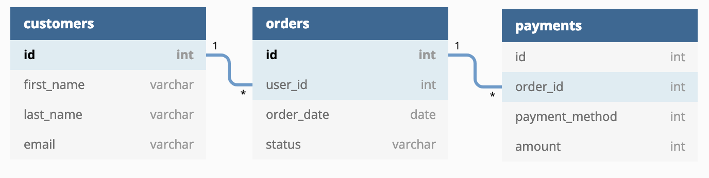
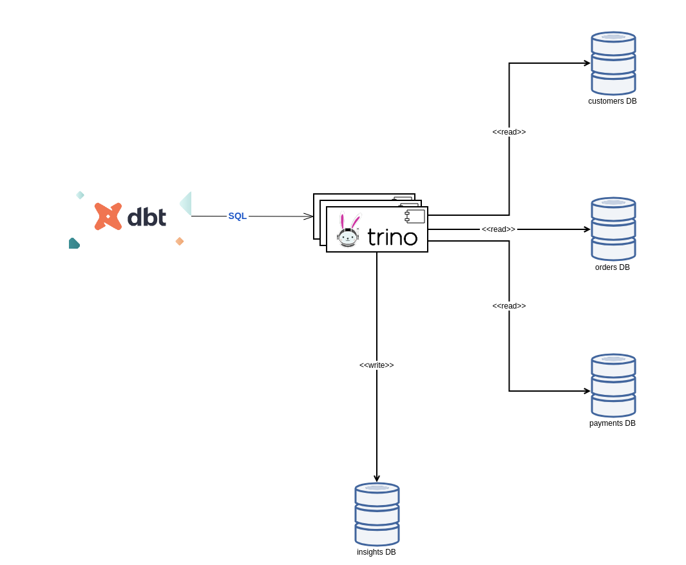

Perform data transformations over a _Data Mesh_ of several databases with [dbt-trino](https://github.com/findinpath/dbt-trino) adapter for [dbt](https://www.getdbt.com/).


## Introduction

One frequently asked question in the context of using `dbt` tool is:

> Can I connect my dbt project to two databases?

(see the answered [question](https://docs.getdbt.com/faqs/connecting-to-two-dbs-not-allowed) on the dbt website).

**tldr;** `dbt` stands for transformation as in `T` within `ELT`  pipelines, it doesn't move data from source to a warehouse.

The creators of the `dbt` however have added support for handling such scenarios via
[dbt-presto](https://github.com/dbt-labs/dbt-presto) adapter.

[Trino](https://trino.io/) is a [fork](https://trino.io/blog/2020/12/27/announcing-trino.html) of the popular
_presto_ high performance, distributed SQL query engine for big data.
This SQL query engine offers a helping hand in performing SQL queries on top of a myriad of data sources.
Trino supports talking to the common relational databases (Postgres, MySQL) and also to data sources
that don't support SQL (AWS S3, Apache Kafka, Apache Cassandra, etc.). Feel free to check
the list of supported Trino [connectors](https://trino.io/docs/current/connector.html) for more details.

By using Trino, there can be queried data from fully separated databases. This makes Trino
_the analytics engine for data mesh_ (quote from [Starburst Data](https://www.starburst.io/) website).


_dbt Trino Architecture Image taken from [Trino Community Broadcast](https://trino.io/episodes/21.html)_


## Data Mesh

[Data Mesh](https://www.thoughtworks.com/radar/techniques/data-mesh) is a paradigm to the data engineering domain
which provides an alternative to the common recipe of using a centralized, monolithic data warehouse.

The principles on which this paradigm is being founded are quoted below:

- domain-oriented decentralization of data ownership and architecture
- domain-oriented data served as a product
- self-serve data infrastructure as a platform to enable autonomous, domain-oriented data teams
- federated governance to enable ecosystems and interoperability.


## `jaffle_shop` Data Mesh

[jaffle_shop](https://github.com/dbt-labs/jaffle_shop/) is a self-contained project showcasing the functionality
of [dbt](https://www.getdbt.com/) data warehouse transformation  tool.

In the context of the project [jaffle_shop](https://github.com/dbt-labs/jaffle_shop/) there are being used
the domains:

- customers
- orders (customers make orders)
- payments (each completed order has a corresponding payment)



Entity Relationship Diagram image taken from [jaffle\_shop](https://github.com/dbt-labs/jaffle_shop) project

In the tutorial `jaffle_shop` project, all the domain entities (customers, orders, payments) as well as the results of the `dbt` transformations are obviously located in tables within the same database.

This blog post provides the answer to the questions answered by the project [jaffle_shop](https://github.com/dbt-labs/jaffle_shop/)
in a _data mesh_ decentralized data warehouse context
where each domain (customer, order, payment) is being stored in a separate database.
The insights gained from the `dbt` transformations will be also saved in a separate database.




## Demo

Check out the [dbt\_jaffle\_shop\_data\_mesh](https://github.com/findinpath/dbt_jaffle_shop_data_mesh) project to try out
the concepts described  in this blog post.

The project is using [docker](https://www.docker.com/) to spin up the `jaffle_shop` Data Mesh environment and for performing the `dbt` transformations.
No other local installation or configuration of a tool is required on the workstation used for testing this showcase.

## `dbt-trino`

`dbt` stands for transformation as in `T` within `ELT`  pipelines, it doesn't move data from source to a warehouse.
`dbt` shines at orchestrating the transformations performed inside a data warehouse.

Below is a quote taken from [Trino: The Definitive Guide](https://trino.io/trino-the-definitive-guide.html) book,
Chapter 1, _Introducing Trino_ :


> Data warehouse systems have created not only huge benefits for users but also a burden on organizations:
> - Running and maintaining the data warehouse is a large, expensive project.
> - Dedicated teams run and manage the data warehouse and the associated ETL  processes.
> - Getting the data into the warehouse requires users to break through red tape and typically takes too much time.
>
> Trino, on the other hand, can be used as a virtual data warehouse. It can be used to
define your semantic layer by using one tool and standard ANSI SQL. Once all the
databases are configured as data sources in Trino, you can query them. Trino pro‐
vides the necessary compute power to query the storage in the databases. Using SQL
and the supported functions and operators, Trino can provide you the desired data
straight from the source. There is no need to copy, move, or transform the data before
you can use it for your analysis.
>
> Thanks to the standard SQL support against all connected data sources, you can cre‐
ate the desired semantic layer for querying from tools and end users in a simpler
fashion. And that layer can encompass all underlying data sources without the need
to migrate any data. Trino can query the data at the source and storage level.


[dbt-trino](https://github.com/findinpath/dbt-trino) is a `dbt` [community adapter](https://docs.getdbt.com/docs/available-adapters)
which offers a possible solution in dealing with transformations performed over a virtually distributed data warehouse.

By using this adapter, `dbt` is still interacting with only one `SQL` query engine, but in case of Trino, this is
a fast distributed SQL query engine for big data analytics that helps you explore your distributed data universe.


```sql
trino> show tables in insights.default;
Table
-------------------
customer_orders
customer_payments
dim_customers
fct_orders
order_payments
stg_customers
stg_orders
stg_payments
(8 rows)

Query 20210918_214153_00126_zb79t, FINISHED, 1 node
Splits: 19 total, 19 done (100.00%)
0.21 [8 rows, 240B] [37 rows/s, 1.09KB/s]
```

As showcased in the demo project, in the snippet above, note that the tables:

- `stg_customers`
- `stg_orders`
- `stg_payments`

are actually *views*, virtual tables, whose contents are defined by queries that are actually performed on
external databases via Trino.

In the model `dim_customers.sql` from the demo project:

```sql
with customers as (

    select * from {{ ref('stg_customers') }}

),

customer_orders as (

    select * from {{ ref('customer_orders') }}

),

customer_payments as (

    select * from {{ ref('customer_payments') }}

),

final as (

    select
        customers.customer_id,
        customer_orders.first_order,
        customer_orders.most_recent_order,
        customer_orders.number_of_orders,
        customer_payments.total_amount as customer_lifetime_value

    from customers

    left join customer_orders on customers.customer_id = customer_orders.customer_id

    left join customer_payments on customers.customer_id = customer_payments.customer_id

)

select * from final
```

the data corresponding to the domain models of the [jaffle_shop](https://github.com/dbt-labs/jaffle_shop/) project:

- customer
- order
- payment

is being joined in order to provide insights across all the aforementioned domain models.


## Conclusion

In case that this post made you interested, feel free to check out the [dbt-trino](https://github.com/findinpath/dbt-trino)
`dbt` adapter.

Try out on your workstation [dbt\_jaffle\_shop\_data\_mesh](https://github.com/findinpath/dbt_jaffle_shop_data_mesh) to get
you a quick look&feel on how [dbt](https://www.getdbt.com/) and [Trino](https://trino.io/) can be used
together effectively for performing transformations on top of data distributed across various silos.

Feedback is very much welcome.
